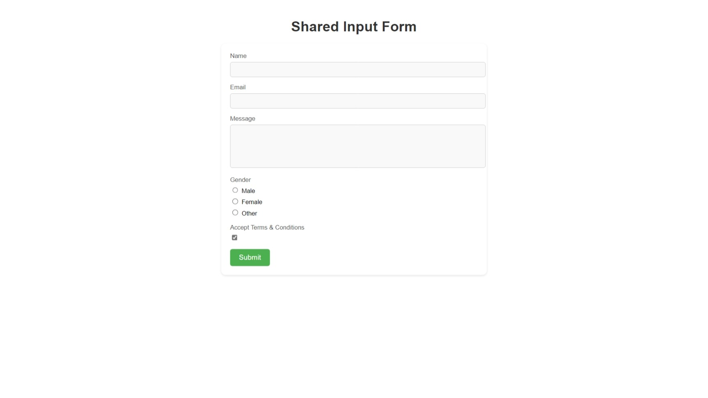

# Shared Input Component

## 1. Task Description

The task is to create a **Shared Input Component** that can handle multiple types of form inputs such as text, textarea, radio buttons, and checkboxes. This reusable component simplifies form creation by dynamically rendering inputs based on configuration. It ensures reusability and clean design while being easy to integrate into any application.

---

## 2. Task Output Screenshot

  

---

## 3. Widget/Algorithm Used In Task

- **Reusable Input Component**:  
  Dynamically renders text, textarea, and radio button inputs based on props like `label`, `type`, and `name`.

- **React State Management**:  
  Tracks user input in real-time and updates the parent form state.

- **CSS for Modern Design**:  
  Styled inputs and labels with responsive layout for better user experience on all devices. 